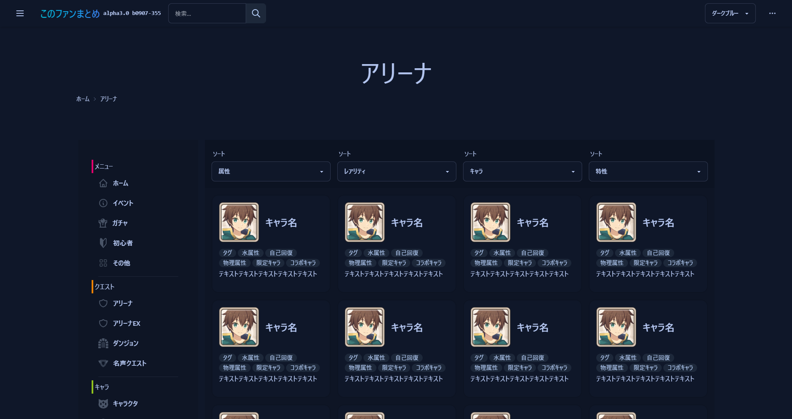
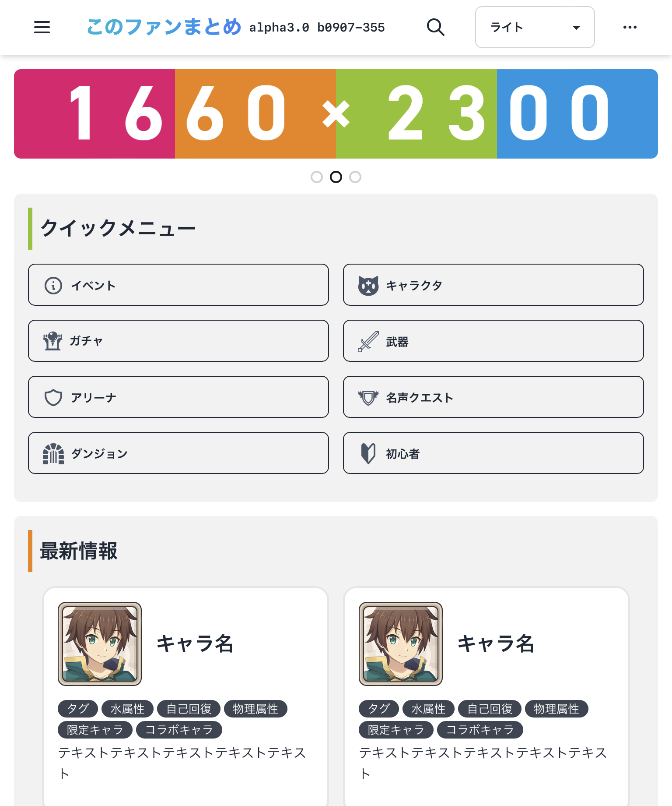

<!-- PROJECT LOGO -->
<div align="center">
  <a href="https://github.com/slimelab060/Konosubainfo_Design">
    
  </a>

<h2 align="center">このファンまとめサイト UI Nuxt3</h2>

  <p align="center">
    サイトのUIソースコード
  </p>
   <h3>お知らせ</h3>
  <p align="left">
Nuxt3からNext.jsに移行したので、今後こちらのレポジトリの更新が止まる可能性があります。
  </p>
  [![repository-url]]
</div>

[![license-shield][license-shield]][license-url]  

## 1. このレポジトリについて






これはデザインのみ公開しているソースコードです。  
まだサイトは見ることはできませんがこのリポジトリをクローンして環境を整えると誰でも使えるようになります。  
これを公開している理由は、単にバージョン管理と保存が目的です。  
Twitter にリンク張るのは正式版のみで開発版は Discord 経由にして見る人を分けています。

データは非公開です。

## 2. 環境構築

このサイトの開発環境は以下の通りです。  

[![NuxtJS][NuxtJS]][Nuxt-url]
[![Vue.js][Vue.js]][Vue-url]

### 2.1. 前提条件

環境を構築するにはNode.jsが必要

  ```sh
  npm install npm@latest -g
  ```

### 2.2. Installation

1. レポジトリからクローン

   ```sh
   git clone https://github.com/slimelab060/Konosubainfo_Design.git
   ```

2. 必要な依存関係をインストール

   ```sh
   npm install
   ```

3. コマンド入力でデバッグ環境構築

   ```sh
   npm run dev -- -o
   ```

## 3. ロードマップ

これは現状作成するものを書いただけです。  
ただNuxt3からNextjsに移行したので、今後こっちのレポジトリの更新は停止する可能性があります。

- [x] ホームページ
- [x] コードの最適化
- [x] Nuxt3正式版移行
- [ ] 記事テンプレート
- [ ] フィルター選択

## 4.更新履歴

[更新履歴](https://github.com/slimelab060/Konosubainfo_Design/blob/main/CHANGELOG.md)はこちらに移動しました。

## 5. ライセンス

 MIT License.

<!-- MARKDOWN LINKS & IMAGES -->
<!-- https://www.markdownguide.org/basic-syntax/#reference-style-links -->
[license-shield]: https://img.shields.io/github/license/slimelab060/Konosubainfo_Design.svg?style=for-the-badge
[license-url]: https://github.com/slimelab060/Konosubainfo_Design/blob/main/LICENSE
[repository-url]: https://github.com/slimelab060/konosubainfonextjs
[NuxtJS]:https://img.shields.io/badge/Nuxt-black?style=for-the-badge&logo=nuxt.js&logoColor=white
[Nuxt-url]: https://nuxt.com/
[Vue.js]:https://img.shields.io/badge/vuejs-%2335495e.svg?style=for-the-badge&logo=vuedotjs&logoColor=%234FC08D
[Vue-url]: https://ja.vuejs.org/