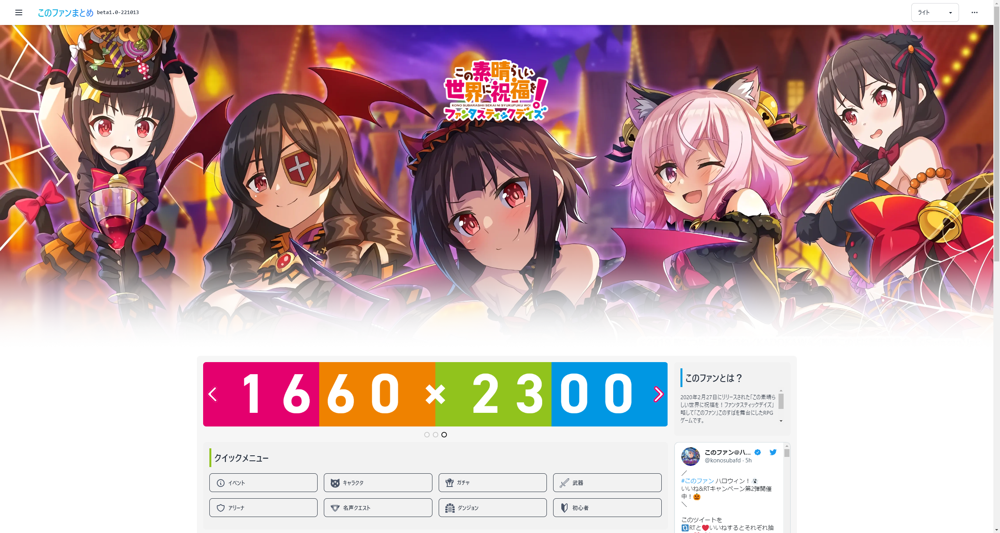
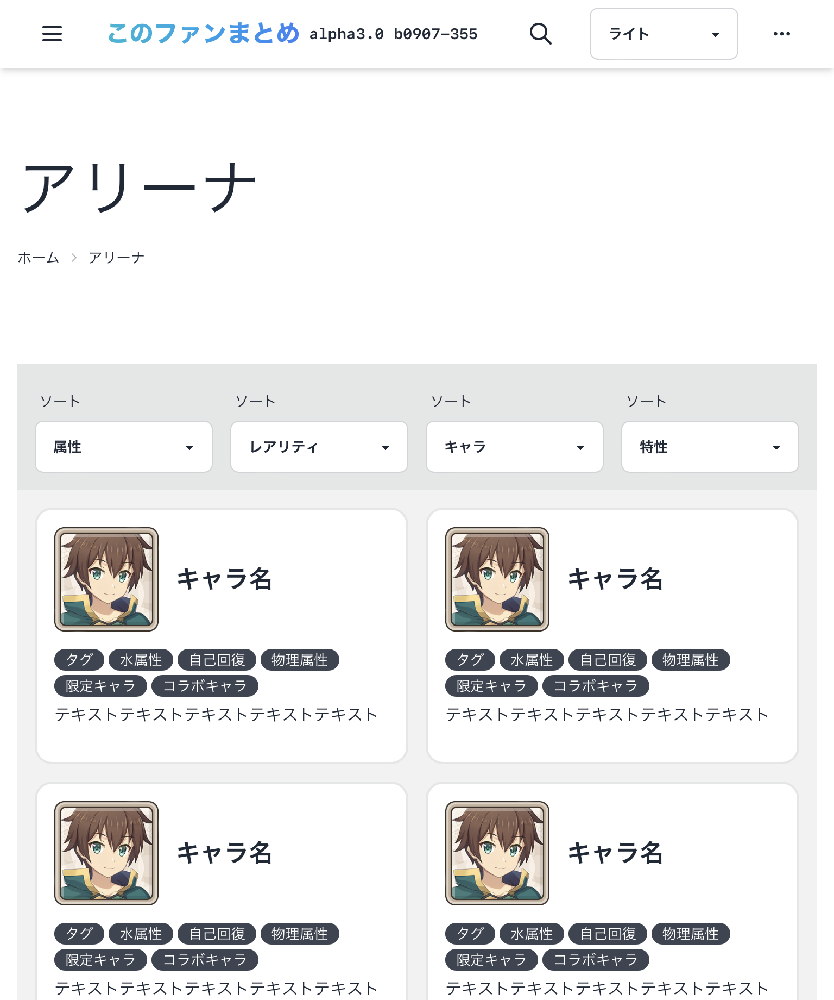

# Konosubainfo_Design

This repository produces the design for the Konofan summary website.

## Information

Functional implementation will be created in a separate repository.






## これは何？
これはこのファンサイトのフロント部分のソースコードです。  
まだサイトは見ることはできませんがこのリポジトリをクローンして環境を整えると使えるようになります。   
これを公開している理由は、単にバージョン管理と保存が目的です。      
なぜDiscord限定で公開しているのか、それはTwitterでの不特定多数に見せるのが嫌だからです。  
Twitterにリンク張るのは正式版のみで開発版はDiscord経由にして見る人を分けています。

## このファンまとめ オリジナルalpha版  更新履歴


:pushpin:**バージョンの名称**:pushpin:  
```
alpha: フレームワークとレイアウトの雛形を作成する段階
beta : 検索機能とタグ機能とコンテンツ作成を実装する段階
RC   : リリース候補の修正段階  
なし : 正式リリース  
```

## 🖥最新更新履歴
**alpha3.0 b20220907-356 last update(公開)**
- Nuxt3 RC6 → Nuxt3 RC9にアップデート~~(RC9はViteNode関係で動作しないのでアップデートしないでください。)~~
- ~~上記に関しては現在対策中~~ 一時的に対象できたのでアップデートは大丈夫になりました。
- ただし一時的に表示できるようにしているため機能の一部は動作しません。
- メニューバー再構築
- レイアウト再構築
- ベータ版に向けて一部試験的に機能追加
- コンテンツ機能追加
- プラグイン追加
- SwiperのScriptからScript setup変更し可読性向上
- その他、細かい変更点&修正

**alpha2.7 b20220723-252(公開)**
- Nuxt3 RC5 → Nuxt3 RC6にアップデート
- カラーテーマを正式に実装(ライト、ダーク、ダークブルー3種類)
- 依存関係のライブラリを自動で解決するRenovate導入(GitHub側)
- metaタグを追加
- ヘッダーがある一定以上スクロールするとヘッダーが消える問題を修正
- メインコンテンツのサイズが正しく表示されていない問題を修正
- Safariで一部のボタンが動作しない問題を修正
- インデントを修正(今までうまく動作してなかったみたい)

**alpha2.6 b20220716-231(公開)**
- グリッドテンプレートの挙動を修正
- コンテンツの最大サイズを1280pxから1536pxに試験的に変更
- 不要なタグを削除し可読性向上

**alpha2.5 b20220714-222(公開)**
- Nuxt3 RC4 → Nuxt3 RC5にアップデート
- それに伴ってレガシープラグインが動作しなくなるので削除

**alpha2.4 b20220713-220(公開)**
- 説明書更新
- 細かな修正
- ヘッダー画像更新(Png → Webp形式変更)
- プラグイン更新
- これによりボトムナビゲーションが使えるようになった
- セキュリティーアップデート(parse-path&parse-url)

**alpha2.3 b20220711-217(一部公開)**
- 一部ファイル削除
- URL公開に合わせてインシデント修正
- Vueuseプラグイン追加

**alpha2.0 b20220706-206(非公開)**
- 細かな修正

**alpha1.9.8 b20220704-203(公開)**
- swiper挙動を修正＆8.2.6にアップデート
- レンダリングのテスト
- 一部レイアウトの順番が逆になっていたので修正

**alpha1.9.1 b20220701-196(公開)**
- コンテンツプラグインの追加実験
- 現在学習中なので次の更新には時間がかかります。

**alpha1.9 b20220629-194(公開)**
- TailwindCSS(Native)からNuxtTailwindCSSに変更
- プラグインアップデート
- コード修正

**alpha1.8 ～ alpha1.8.7-b20220628-190(公開)**  
- app.vueをNuxtPageに変更
- 今まで統合されていた機能をコンポネント化
- AboutとPrivacypolicyのページ追加(中身はまだない)
- Nuxtdocに従ってファイルを配置変更

**alpha1.7-b20220626-178(非公開)**  
- 細かな修正

**alpha1.6-b20220621-165(非公開)**  
- 一部のテーマ削除
- コンポネントの移植準備

**alpha1.5.2-b20220620-158(公開)**  
- 一部脆弱性のライブラリが存在していたのでアップデート  
- Tailwind CSS v3.0.24からv3.1.3にアップデート  

**alpha1.5.1-b20220619-157(Twitterで一部公開&公開)**  
- 文字ロゴを変更  
- 検索枠追加  
- 細かいレイアウトの修正  

**alpha1.5-b20220619-155(非公開)**  
- このすばの背景とロゴを追加(1024px以上のタブレットとPCが対象)  
- ヘッダーとフッターを外側に配置を変更  
- 使用端末の解像度が1024px以下の場合は1カラム表示に変更  

**alpha1.4-b20220617-128(非公開)**  
- Grid構成を変更して保守しやすいように修正  
- レスポンシブに対応(一部レイアウト未対応)  
- ダークテーマ対応(テストのためテーマは29種類試せるようになっています)  
- ダークテーマに対応するにあたって一部クラス名を変更  

**alpha1.3-b20220604-113(Twitterで一部公開)**  
- フレームワーク再構築  
- Grid構成を変更して保守しやすいようになった  
- レスポンシブに対応(一部レイアウト未対応)  

**alpha1.2.1-b20220603-64(非公開)**  
- flexをメインで使用していた部分を廃止  
- アドサイド廃止  
- Swiperのサイズ変更時に挙動がおかしくなってなっていたので修正  

**alpha1.2-b20220602-38(非公開)**  
- IE11サポート終了が近づいてきたのでレイアウトGridベースに変更  
- サイドメニューを廃止  

**alpha1.1-b20220528-24-(公開)**  
- Tailwind CSSベースに変更  
- これによりCSSに直接書く必要がなくなった  

**alpha1.0.7-b20220522-15(非公開)**  
- タイマー処理を一時保留(今後使うか使用用途が不明になったため)  
- プラグイン「Tailwind CSS v3.0.24」 追加  
- TailwindCSSそのまま使うのは骨が折れるのでそのプラグイン「daisyUI」追加  

**alpha1.0.4-b20220519-7(非公開)**  
- コンポーネント作成  
- Header ,Footer, Content, SideMenu, Adside追加  

**alpha1.0.1-b20220517-3(非公開)**  
- タイマー同期処理を修正  

**alpha1.0-b20220516-1(非公開)**  
- 簡易フレームワークの作成

## ライセンス
[MIT](https://github.com/slimelab060/Konosubainfo_Design/blob/main/LICENSE)